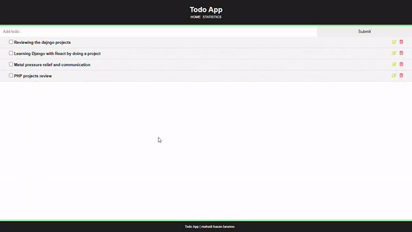
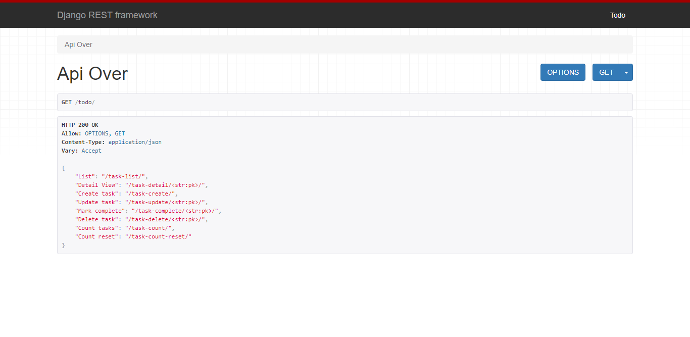

# TodoApp-React-Django

#### A basic understanding of working with ReactJs and Django REST framework. This app have used the basic REST functionalities and CURD

Simple Todo app to list tasks, mark them complete, deleteing.
method used in REST API is GET, POST, DELETE. A basic implementation of CURD using Django REST framework.
Django rest framework documentation: https://django-rest-framework.org

## Api Overview

## Corsheaders
#### for using the API in ReactJs we have to install corsheaders in Django
corsheaders documentation: https://pypi.org/project/django-cors-headers/

## ChartJs
#### ChartJS is a simple and easy library for making charts using js.
I added a basic implementaion and adding process of ChartJs in React. 
ChartJs documnetation: https://www.chartjs.org/docs/latest/

NOTE: react_frontend folder is missng mode_modules files. we have to receate the app again.

# Super user: Todo
